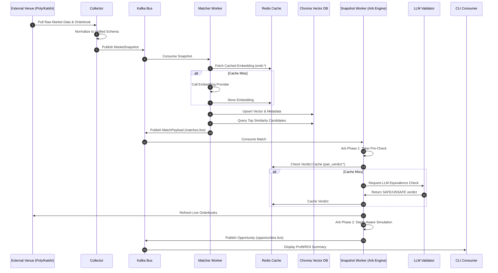
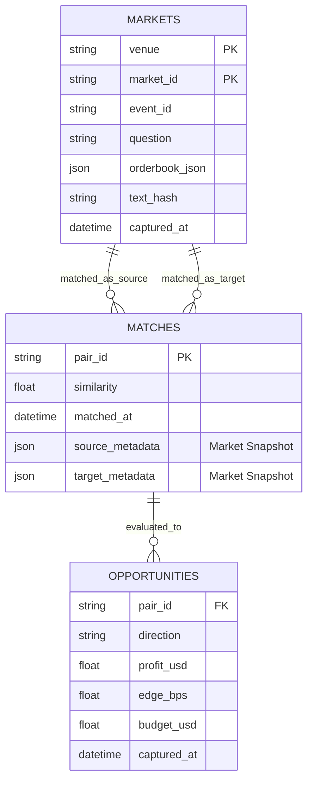
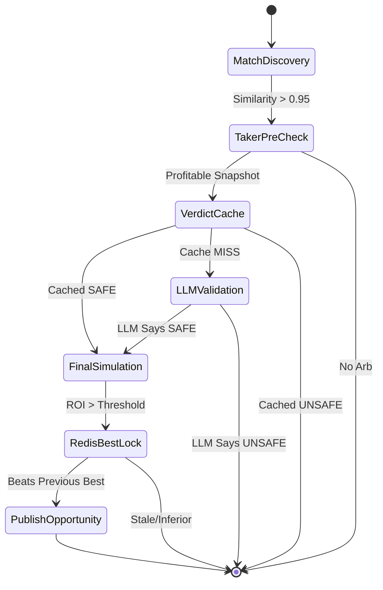

# Arbitrage Detector Architecture

This document captures the full problem definition, pipeline, and concrete schemas for the Polymarket/Kalshi cross-venue arbitrage project. Every new contributor/agent can rely on this file to understand the current plan end-to-end.

## Problem Space

Goal: Continuously detect risk-free (or near risk-free) arbitrage opportunities between **Polymarket** and **Kalshi** binary markets.

Requirements:

- Fetch live markets plus orderbooks from both venues within their documented rate limits.
- Match semantically equivalent markets while ensuring their resolution criteria and sources are compatible.
- Compute arbitrage feasibility using executable taker prices, depth-based slippage, and Kalshi fee formulas (rounded up to the nearest cent). Polymarket fees are currently 0 unless their API indicates otherwise.
- Enforce per-market tick sizes when planning any hypothetical execution.
- Refresh prices immediately before publishing an opportunity to guard against stale data.
- Produce CLI output for now **and** persist all normalized data/opportunities in SQLite for later analytics/frontends.

Key references:
- Polymarket Gamma + CLOB docs (rate limits, resolution fields, per-market tick sizes).
- Kalshi Trade API docs (events, series, market orderbooks, fee schedule, rate limits).
- Nebius OpenAI-compatible API for embeddings + LLM validation.

## Pipeline Architecture & Data Lifecycle

### System Topology Storyboard

This interactive storyboard visualizes the system's chronological pipeline. The data flows strictly from left to right, maturing from raw market ingestion into validated, modeled opportunities.

```mermaid
%%{init: {
  'theme': 'base',
  'themeVariables': {
    'primaryColor': '#ffffff',
    'primaryTextColor': '#1e293b',
    'primaryBorderColor': '#3b82f6',
    'lineColor': '#64748b',
    'secondaryColor': '#f8fafc',
    'tertiaryColor': '#ffffff',
    'edgeLabelBackground':'#ffffff',
    'fontSize': '12px',
    'fontFamily': 'ui-sans-serif, system-ui, sans-serif'
  }
}}%%

flowchart LR
    %% === CLASS DEFINITIONS ===
    classDef worker fill:#eff6ff,stroke:#3b82f6,stroke-width:2px,color:#1e40af,font-weight:bold;
    classDef queue fill:#dcfce7,stroke:#16a34a,stroke-width:2px,color:#14532d,font-weight:bold;
    classDef infra fill:#fff7ed,stroke:#f59e0b,stroke-width:1px,color:#9a3412,font-style:italic;
    classDef venue fill:#f8fafc,stroke:#cbd5e1,stroke-width:1px,color:#475569;
    classDef engine fill:#fff1f2,stroke:#e11d48,stroke-width:2px,color:#9f1239;

    %% === PERSISTENT BACKBONE ===
    REDIS[(Redis State & Distributed Locks)]:::infra
    SQLITE[(SQLite Data Warehouse)]:::infra

    %% === STAGE 1: INGESTION ===
    subgraph ST1 [1. Ingestion Stack]
        direction TB
        POLY_API([Polymarket API]):::venue
        KAL_API([Kalshi API]):::venue
        
        subgraph COLLECTORS [Collectors]
            direction LR
            P_COLL[[Polymarket Collector]]:::worker
            K_COLL[[Kalshi Collector]]:::worker
        end
        
        POLY_API --> P_COLL
        KAL_API --> K_COLL
    end

    %% === CONNECTOR: SNAPSHOT QUEUES ===
    subgraph ST_QUEUES [Kafka Ingestion Fabric]
        direction TB
        Q_POLY{{"[Queue] snapshots.polymarket"}}:::queue
        Q_KAL{{"[Queue] snapshots.kalshi"}}:::queue
    end

    P_COLL ==> Q_POLY
    K_COLL ==> Q_KAL
    P_COLL & K_COLL -.->|Archive| SQLITE

    %% === STAGE 2: SEMANTIC HUB ===
    subgraph ST2 [2. Semantic Hub]
        direction TB
        MATCHER[[Embedding Matcher]]:::worker
        CHROMA[(/ Chroma Vector Store /)]:::infra
        MATCHER <==> CHROMA
    end

    Q_POLY & Q_KAL ==> MATCHER
    MATCHER <==>|Cache Embeddings| REDIS

    %% === CONNECTOR: MATCH QUEUE ===
    Q_MATCHES{{"[Queue] matches.live"}}:::queue
    MATCHER ==> Q_MATCHES

    %% === STAGE 3: ANALYSIS ===
    subgraph ST3 [3. Validation & Resolution]
        direction TB
        PRE_CHECK[[Arb Engine - Phase 1 - Pre-Check]]:::worker
        VALIDATOR([LLM Equivalence Validator]):::infra
        PDF_RULES[/ PDF Rule Extraction /]:::infra
        PRE_CHECK ==> VALIDATOR
        VALIDATOR --- PDF_RULES
    end

    Q_MATCHES ==> PRE_CHECK
    PRE_CHECK <==>|Verdict Check| REDIS

    %% === STAGE 4: MODELING ===
    subgraph ST4 [4. Opportunity Modeling Plane]
        direction TB
        ARB_ENGINE[[Arb Engine - Phase 2 - Simulation]]:::engine
        REFETCH([Real-time Re-fetch]):::venue
        WALK[/ Orderbook Walking /]:::engine
        ARB_ENGINE --- REFETCH
        ARB_ENGINE --- WALK
    end

    VALIDATOR ==>|Verified Safe| ARB_ENGINE
    ARB_ENGINE <==>|Throttle / Best Profit| REDIS
    ARB_ENGINE -.->|Analytics Export| SQLITE

    %% === CONNECTOR: OPPORTUNITY QUEUE ===
    Q_OPPS{{"[Queue] opportunities.live"}}:::queue
    ARB_ENGINE ==> Q_OPPS

    %% === STAGE 4: DELIVERY ===
    subgraph ST5 [5. Delivery]
        direction TB
        CLI([CLI Consumer]):::worker
    end

    Q_OPPS ==> CLI

    %% === LAYOUT FORCING ===
    ST1 ~~~ ST_QUEUES ~~~ ST2 ~~~ Q_MATCHES ~~~ ST3 ~~~ ST4 ~~~ Q_OPPS ~~~ ST5
```

### Lifecycle Sequence Flow

The following sequence diagram tracks a single market state transition from ingestion through to opportunity publication.

## Component Responsibilities

| Component | Responsibility |
| --- | --- |
| `polymarket_collector` | Paginate Gamma events, fetch details, normalize, and publish to Kafka snapshots. |
| `kalshi_collector` | Paginate markets, fetch snippets + orderbooks, normalize, and publish to Kafka. |
| `polymarket_worker` | Vectorize Polymarket snapshots via Nebius and upsert to Chroma. |
| `kalshi_worker` | Vectorize Kalshi snapshots via Nebius and upsert to Chroma. |
| `snapshot_worker` | Consumes matches; orchestrates Pre-Checks, Equivalence Validation, and Simulations. |
| `chroma_maintainer` | Lifecycle management: purge stale embeddings (>1 hour) from vector store. |
| `cli_consumer` | Real-time CLI dashboard displaying profitable modeled opportunities. |

All components run in Go using Docker Compose for local orchestration. Supporting services: Kafka, Redis, SQLite (file-based), ChromaDB, Nebius API access.

## Message Bus Topology (Kafka)

The system utilizes Kafka as a strictly ordered snapshot stream and candidate bus.

| Topic | Partition Key | Payload Type |
| --- | --- | --- |
| `snapshots.polymarket` | `market_id` | Normalized MarketSnapshot |
| `snapshots.kalshi` | `market_ticker` | Normalized MarketSnapshot |
| `matches.live` | `pair_id` | Similarity Candidate + Snapshots |
| `opportunities.live` | `pair_id` | Modeled Arb Opportunity |

## Persistent State (Redis)

The following table maps the key-space hierarchy used for low-latency caching and distributed locking across the processing pipeline.

| Key Pattern | Purpose | Lifetime (TTL) |
| :--- | :--- | :--- |
| `emb:<venue>:<market_id>:<hash>` | Vector embeddings for market text | 10 Days |
| `pair_verdict:<sorted_hashes>` | Binary LLM equivalence verdicts (SAFE/UNSAFE) | 10 Days |
| `pair_bundle:<ids>:<hashes>` | Cached modeling summaries for valid pairs | Persistent |
| `pair_inflight:<pair_id>` | Distributed lock to prevent duplicate analysis | 60 Seconds |
| `pair_best:<pair_id>` | Suppression lock for previously reported profit peaks | 72 Hours |

## Data Models & Schema (Warehouse)

The system utilizes a relational data model for historical analytics and vector-based lookups for real-time matching.

## SQLite Tables (analytics only)

Used as a warehouse; runtime logic never depends on these tables.

- `markets` (PRIMARY KEY `(venue, market_id)`): stores the normalized snapshot for every venue. Columns mirror the collector structs:
  - Venue + identifiers: `venue`, `market_id`, `event_id`.
  - Event metadata: `event_title`, `event_description`, `event_category`, `event_status`, `resolution_source`, `resolution_details`, `settlement_sources_json`, `contract_terms_url`.
  - Market metadata: `question`, `subtitle`, `reference_url`, `close_time`, `tick_size`, `yes_bid`, `yes_ask`, `no_bid`, `no_ask`, `volume`, `volume_24h`, `open_interest`, `clob_token_yes`, `clob_token_no`.
  - Orderbook depth + metadata (per market snapshot): `yes_bids_json`, `yes_asks_json`, `no_bids_json`, `no_asks_json`, `book_captured_at`, `book_hash`. These capture the ladder as arrays of `[price, quantity, rawPrice, rawAmount]` ready for downstream slippage simulations.
  - Hashes, bookkeeping, and debugging: `text_hash`, `resolution_hash`, `last_seen_at`, `raw_json`.
- (coming later) `pairs`, `pair_decisions`, and `opportunities` tables for downstream stages once implemented.

## LLM Matching & Decision Logic

The following state diagram illustrates the decision gatekeepers that a matched pair must pass before being published as an opportunity.

## LLM + Matching Details

- Embeddings: Nebius OpenAI-compatible model, focusing on title + description (and optional resolution description if it adds clarity). Resolution sources are **not** included to avoid punishing otherwise equivalent markets.
- Matching: topK=3; threshold 0.95 cosine similarity. Deterministic filters on timing, numeric thresholds, etc. Additional pairs can be tested if the top result was previously rejected.
- LLM validation (Nebius) triggers only when there is no cached verdict for the current resolution hashes. Prompt includes both market descriptions, resolution text, and Kalshi settlement sources/contract_terms references. Outputs SAFE/UNSAFE.
- The matcher walks up to the top 3 candidates from Chroma. For each candidate
  it checks Redis: cached UNSAFE verdicts are skipped (try the next candidate),
  cached SAFE verdicts are re-published immediately, and only uncached pairs
  hit the LLM.

## Fees & Slippage

- Polymarket fees currently assumed 0 (watch for API updates).
- Kalshi taker fee: `roundUpToCent(0.07 * C * P * (1-P))`.
- Final arb engine always retrieves fresh orderbooks and walks depth for configured budgets (default $100, easily configurable). Maker scenarios deferred until later.

## Freshness + Cleanup

- Chroma: entries older than 1 hour deleted by maintainer job (ensures matches only consider recent markets).
- Matching window: only consider Chroma hits updated within last hour, but Redis caches can live longer because they’re guarded by text/resolution hashes.
- Final arb fetch: always hits live APIs; failure to fetch (market closed, etc.) should be handled gracefully and logged.

## CLI Output

- Consumes `opportunities.live` and prints structured summaries with pair IDs, venue directions, profit, budgets, freshness, and references to resolution info/LLM verdict.
- Acts as a reference “UI” until a dedicated frontend/API is built.

---

This architecture reflects the latest decisions (SQLite warehouse, Nebius embeddings/LLM, single worker pipeline, two Kafka stages, Redis-based caching). Update this file whenever design changes so future agents can bootstrap instantly.
