# Arbitrage

This repository builds a **Polymarket ↔ Kalshi cross-venue arbitrage detector**. It continuously ingests markets from both venues, finds equivalent events via embeddings + LLM validation, simulates executable taker trades (fees + slippage), and surfaces profitable opportunities via CLI while writing all normalized data into SQLite for future analytics/frontends. Every component is containerized (Docker + Colima) so agents get deterministic environments; see `experiments/README.md` for Colima/Docker prerequisites.

## Architecture Storyboard

```mermaid
%%{init: {
  'theme': 'base',
  'themeVariables': {
    'primaryColor': '#ffffff',
    'primaryTextColor': '#1e293b',
    'primaryBorderColor': '#3b82f6',
    'lineColor': '#64748b',
    'secondaryColor': '#f8fafc',
    'tertiaryColor': '#ffffff',
    'edgeLabelBackground':'#ffffff',
    'fontSize': '12px',
    'fontFamily': 'ui-sans-serif, system-ui, sans-serif'
  }
}}%%

flowchart LR
    %% === CLASS DEFINITIONS ===
    classDef worker fill:#eff6ff,stroke:#3b82f6,stroke-width:2px,color:#1e40af,font-weight:bold;
    classDef queue fill:#dcfce7,stroke:#16a34a,stroke-width:2px,color:#14532d,font-weight:bold;
    classDef infra fill:#fff7ed,stroke:#f59e0b,stroke-width:1px,color:#9a3412,font-style:italic;
    classDef venue fill:#f8fafc,stroke:#cbd5e1,stroke-width:1px,color:#475569;
    classDef engine fill:#fff1f2,stroke:#e11d48,stroke-width:2px,color:#9f1239;

    %% === PERSISTENT BACKBONE ===
    REDIS[(Redis State & Distributed Locks)]:::infra
    SQLITE[(SQLite Data Warehouse)]:::infra

    %% === STAGE 1: INGESTION ===
    subgraph ST1 [1. Ingestion Stack]
        direction TB
        POLY_API([Polymarket API]):::venue
        KAL_API([Kalshi API]):::venue
        
        subgraph COLLECTORS [Collectors]
            direction LR
            P_COLL[[Polymarket Collector]]:::worker
            K_COLL[[Kalshi Collector]]:::worker
        end
        
        POLY_API --> P_COLL
        KAL_API --> K_COLL
    end

    %% === CONNECTOR: SNAPSHOT QUEUES ===
    subgraph ST_QUEUES [Kafka Ingestion Fabric]
        direction TB
        Q_POLY{{"[Queue] snapshots.polymarket"}}:::queue
        Q_KAL{{"[Queue] snapshots.kalshi"}}:::queue
    end

    P_COLL ==> Q_POLY
    K_COLL ==> Q_KAL
    P_COLL & K_COLL -.->|Archive| SQLITE

    %% === STAGE 2: SEMANTIC HUB ===
    subgraph ST2 [2. Semantic Hub]
        direction TB
        MATCHER[[Embedding Matcher]]:::worker
        CHROMA[(/ Chroma Vector Store /)]:::infra
        MATCHER <==> CHROMA
    end

    Q_POLY & Q_KAL ==> MATCHER
    MATCHER <==>|Cache Embeddings| REDIS

    %% === CONNECTOR: MATCH QUEUE ===
    Q_MATCHES{{"[Queue] matches.live"}}:::queue
    MATCHER ==> Q_MATCHES

    %% === STAGE 3: ANALYSIS ===
    subgraph ST3 [3. Validation & Resolution]
        direction TB
        PRE_CHECK[[Arb Engine - Phase 1 - Pre-Check]]:::worker
        VALIDATOR([LLM Equivalence Validator]):::infra
        PDF_RULES[/ PDF Rule Extraction /]:::infra
        PRE_CHECK ==> VALIDATOR
        VALIDATOR --- PDF_RULES
    end

    Q_MATCHES ==> PRE_CHECK
    PRE_CHECK <==>|Verdict Check| REDIS

    %% === STAGE 4: MODELING ===
    subgraph ST4 [4. Opportunity Modeling Plane]
        direction TB
        ARB_ENGINE[[Arb Engine - Phase 2 - Simulation]]:::engine
        REFETCH([Real-time Re-fetch]):::venue
        WALK[/ Orderbook Walking /]:::engine
        ARB_ENGINE --- REFETCH
        ARB_ENGINE --- WALK
    end

    VALIDATOR ==>|Verified Safe| ARB_ENGINE
    ARB_ENGINE <==>|Throttle / Best Profit| REDIS
    ARB_ENGINE -.->|Analytics Export| SQLITE

    %% === CONNECTOR: OPPORTUNITY QUEUE ===
    Q_OPPS{{"[Queue] opportunities.live"}}:::queue
    ARB_ENGINE ==> Q_OPPS

    %% === STAGE 5: DELIVERY ===
    subgraph ST5 [5. Delivery]
        direction TB
        CLI([CLI Consumer]):::worker
    end

    Q_OPPS ==> CLI

    %% === LAYOUT FORCING ===
    ST1 ~~~ ST_QUEUES ~~~ ST2 ~~~ Q_MATCHES ~~~ ST3 ~~~ ST4 ~~~ Q_OPPS ~~~ ST5
```

The latest end-to-end architecture, schemas, and pipeline details live in [ARCHITECTURE.md](ARCHITECTURE.md).

## Repository Layout

- `experiments/` – proven setups for every technology used in the main system (Go in Docker, SQLite, Redis, Kafka, Chroma+Nebius embeddings, Nebius LLM CLI, Polymarket/Kalshi API demos). Refer to its README for per-experiment commands.
- `ARCHITECTURE.md` – comprehensive design/requirements document (problem statement, pipeline, schemas).
- `agents.md` – workflow/hand-off guidelines for LLM agents (how we build/test iteratively, container usage expectations).
- `cmd/`, `internal/`, etc. – will host the production services mirroring the architecture (collectors, snapshot worker, CLI consumer, etc.).

## Quick Start

1. Review [ARCHITECTURE.md](ARCHITECTURE.md) for the canonical plan.
2. Ensure your local Go toolchain is **1.24+** (run `go env -w GOTOOLCHAIN=go1.24.11` if you only have Go ≥1.21 installed) or rely on the Docker targets below.
3. Copy `example.env` → `.env` (or export the listed variables manually) so collectors/workers share the same configuration (`SQLITE_PATH`, `KAFKA_BROKERS`, `REDIS_ADDR`, worker counts, etc.). **Set `NEBIUS_API_KEY` before running the embeddings pipeline.**
4. Run Colima + Docker with working DNS (`colima start --dns 1.1.1.1 --dns 8.8.8.8`).
5. From repo root, explore the experiments to verify dependencies:
   - `make -C experiments run-polymarket-events`
   - `make -C experiments run-kalshi-events`
   - `make -C experiments run-chroma-create` (requires `experiments/.env` with `NEBIUS_API_KEY`)
6. Initialize/migrate SQLite (runs inside Docker, default path `data/arb.db` mounted from the repo). **All migration commands drop data, so re-run collectors afterwards.**
   - `make sqlite-create` – creates the unified `markets` table (run once for new environments).
   - `make sqlite-migrate` – drops legacy `polymarket_markets`/`kalshi_markets` tables and recreates the unified schema (destroys data; run after pulling this change).
   - `make sqlite-clear` – optional reset of all rows.
   - `make sqlite-drop` – removes the table entirely.
7. Run the dockerized collectors (all containerized via `docker-compose.yml`):
   - `make run-polymarket-collector` – production loop (quiet logs) that polls continuously and relies on built-in exponential backoff when rate-limited.
   - `make run-polymarket-collector-dev` – same logic but dumps every normalized JSON payload in real time for debugging.
   - `make run-kalshi-collector` / `make run-kalshi-collector-dev` – Kalshi equivalents.
   - `make run-collectors` / `make run-collectors-dev` – run both production or both dev collectors together; `make collectors-down` stops/removes containers.
8. Run the Kafka + embeddings pipeline when needed (spins up ZooKeeper, Kafka, Redis, Chroma, collectors, and workers):
   - `make run-kafka` – production collectors + workers. Each snapshot is embedded via Nebius and upserted into Chroma; only success/error summaries are logged.
   - `make run-kafka-dev` – same stack but workers log a concise `upserted market=… event=…` line per snapshot.
   - `make run-kafka-dev-verbose` – identical to the dev stack, except workers also dump the full JSON payloads as they consume them.
   - Collectors always run in production mode (no stdout spam). Adjust topics/broker/Chroma settings via env vars (`KAFKA_BROKERS`, `POLYMARKET_KAFKA_TOPIC`, `KALSHI_KAFKA_TOPIC`, `CHROMA_URL`, `CHROMA_COLLECTION`).
9. Matching stage – the existing workers now query Chroma right after each upsert to find fresh opposite-venue candidates. Tune `MATCH_TOP_K`, `MATCH_SIMILARITY_THRESHOLD`, and `MATCH_FRESH_WINDOW_SECONDS` in your env to control search breadth, then pick the appropriate command: prod logs errors only, `*_worker_dev` prints concise match lines, and setting the existing `*_WORKER_VERBOSE=1` flag dumps full snapshots just like before. Every match is appended to `matches.log` for inspection and published to Kafka (`MATCHES_KAFKA_TOPIC`, default `matches.live`). Embeddings are pulled from Redis (key format `emb:<venue>:<market_id>:<text_hash>`) when available, otherwise Nebius is called and the vector is written back with a 10-day TTL so replays don’t re-embed unchanged markets. The matcher also consults a verdict cache (key `pair_verdict:<sorted venue:id:text_hash>|...`) so previously SAFE pairs skip directly to the final arb stage, while cached UNSAFE pairs fall through to the next candidate before giving up.
10. `snapshot_worker` – consumes `matches.live`, runs the taker-only arb pre-check, then calls the Nebius GPT-OSS 120B validator (temperature 0) with full Polymarket/Kalshi resolution data plus the Kalshi contract PDF text (extracted via `pdftotext`; installed automatically inside Docker, install `poppler-utils` locally if you run outside containers). Only profitable/tradable pairs reach this stage, and every verdict is logged (`ValidResolution`, `ResolutionReason`). After a SAFE verdict the worker immediately refetches both markets, attaches the fresh snapshots, and runs the final slippage-aware arb engine so the user sees up-to-date profitability. The fresh run writes `pair_best:<pair_id>` entries in Redis (TTL tuned via `OPPORTUNITY_CACHE_TTL_HOURS`) so duplicate alerts are suppressed unless the new profit beats the cached best. Configure `SNAPSHOT_WORKER_CONCURRENCY`, `SNAPSHOT_WORKER_GROUP`, `SNAPSHOT_WORKER_BUDGET_USD`, `SNAPSHOT_WORKER_FORCE_VALIDATION`, `SNAPSHOT_WORKER_BYPASS_LLM`, and the `VALIDATOR_*` env vars to tune throughput/budget.
11. Redis helpers – `make redis-cache-list` prints all cached embeddings (`emb:*`), and `make redis-cache-clear` deletes them if you need a clean run. Verdict cache entries live under `pair_verdict:*` (inspect with `docker compose exec redis redis-cli --scan --pattern 'pair_verdict:*'` if needed).
11. `arb_engine` – consumes `matches.live`, simulates both directions with depth-aware fills + Kalshi fees, and logs every result (profitable or not). Configure `ARB_ENGINE_WORKERS`, `ARB_ENGINE_GROUP`, and `ARB_ENGINE_BUDGET_USD` to tune throughput/budget.
11. When building new services, follow the architecture’s guidance for Kafka topics, Redis caches, Chroma schema, and SQLite warehouse tables. Implement work in small, testable increments so each hand-off can be verified before moving on (see `agents.md`).

### SQLite schema summary

The unified `markets` table (backed by `data/arb.db` by default) mirrors the normalized structs we publish downstream. Key columns:

- `venue` (`polymarket` | `kalshi`), `market_id`, `event_id`
- Event metadata: `event_title`, `event_description`, `event_category`, `event_status`, `resolution_source`, `resolution_details`, `settlement_sources_json`, `contract_terms_url`
- Market metadata: `question`, `subtitle`, `reference_url`, `close_time`, `tick_size`, `yes_bid/ask`, `no_bid/ask`, `volume`, `volume_24h`, `open_interest`, `clob_token_yes/no`
- Orderbook depth + metadata (used for slippage modeling): `yes_bids_json`, `yes_asks_json`, `no_bids_json`, `no_asks_json`, `book_captured_at`, `book_hash`
- Hashes/timestamps/raw payload: `text_hash`, `resolution_hash`, `last_seen_at`, `raw_json`
- `yes_bids_json` / `yes_asks_json`: JSON arrays of `[price, quantity, rawPrice, rawAmount]` storing the entire ladder captured at `book_captured_at`. Slippage calculations will walk these levels (and the corresponding `no_*` ladders) to compute executable weighted-average fill prices.
- `book_hash`: SHA-256 of the ladder JSON blobs; useful for deduping collector snapshots or cache keys when feeding downstream services.

Use `sqlite3 data/arb.db 'SELECT * FROM markets LIMIT 5'` (or any GUI) to inspect exactly what will be sent to Kafka later.

### Chroma vector store summary

Every Kafka snapshot is embedded via Nebius and upserted into a Chroma collection (defaults to `market_snapshots`). Each entry contains:

- **Embedding text** – concatenation of `event_title`, `question`, settle date, and trimmed `event_description`/`subtitle` (≈ ≤7 sentences). No resolution sources or orderbook data are included in the embedding text.
- **Document** – the full `MarketSnapshot` JSON (event + specific market + `captured_at`). This lets downstream services work directly from Chroma without re-querying SQLite.
- **Metadata** – key fields for filtering/invalidations:
  - `venue`, `market_id`, `event_id`
  - `captured_at` (ISO timestamp) and `captured_at_unix` (Unix seconds for numeric filters)
  - `close_time` if available
  - `text_hash` (hash of the embedding text) and `resolution_hash` (hash of resolution source/details)
  - any additional fields we need for freshness filters (e.g., `category` later on)

Each upsert uses the ID `venue:market_id`, so successive snapshots overwrite the same vector while updating metadata (especially `captured_at`).

## Status

- Architecture + experiments are finalized and in sync (SQLite instead of MySQL, Nebius instead of Gemini, taker-only execution for now).
- Implementation work will wire the collectors, snapshot worker, and CLI on top of the proven experiments.

Keep this README and `ARCHITECTURE.md` updated whenever design decisions change so future sessions can ramp up instantly.
