# Arbitrage: Real-time Cross-Venue Prediction Market Liquidity Engine

An event-driven arbitrage detection platform for prediction markets. This system continuously monitors **Polymarket** and **Kalshi** to identify price discrepancies across equivalent events using semantic search and LLM-powered validation.

[](https://go.dev/)
[](ARCHITECTURE.md)

## Overview

This engine solves the fragmentation problem in prediction markets. When a real-world event is listed on multiple venues, prices often diverge. This platform automates the discovery and analysis of these opportunities.

### Key Capabilities
- **High-Throughput Ingestion**: Distributed collectors polling venue APIs with exponential backoff and rate-limit awareness.
- **Semantic Matching Hub**: Uses ChromaDB and vector embeddings to identify equivalent markets across venues, even when titles and descriptions differ.
- **LLM-Powered Validation**: Employs Large Language Models (LLM) to verify resolution criteria and contract terms, ensuring "apples-to-apples" comparisons.
- **Orderbook Analysis**: Depth-aware slippage simulation that walks bid/ask ladders to calculate true executable profitability (including fees).
- **Persistence & Analytics**: Unified SQLite warehouse for historical analysis and Redis for distributed state locking and embedding caching.

---

## Architecture

The system is designed as a multi-stage asynchronous pipeline powered by Kafka, ensuring durability and horizontal scalability.

```mermaid
%%{init: {
  'theme': 'base',
  'themeVariables': {
    'primaryColor': '#ffffff',
    'primaryTextColor': '#1e293b',
    'primaryBorderColor': '#3b82f6',
    'lineColor': '#1e293b',
    'secondaryColor': '#f8fafc',
    'tertiaryColor': '#ffffff',
    'edgeLabelBackground':'#ffffff',
    'fontSize': '12px',
    'fontFamily': 'ui-sans-serif, system-ui, sans-serif'
  }
}}%%

flowchart LR
    subgraph CANVAS [Arbitrage Engine Data Flow]
        direction LR
        %% === CLASS DEFINITIONS ===
        classDef worker fill:#eff6ff,stroke:#3b82f6,stroke-width:2px,color:#1e40af,font-weight:bold;
        classDef queue fill:#dcfce7,stroke:#16a34a,stroke-width:2px,color:#14532d,font-weight:bold;
        classDef infra fill:#fff7ed,stroke:#f59e0b,stroke-width:1px,color:#9a3412;
        classDef venue fill:#f1f5f9,stroke:#94a3b8,stroke-width:1px,color:#334155;
        classDef engine fill:#fff1f2,stroke:#e11d48,stroke-width:2px,color:#9f1239;

        %% === PERSISTENT BACKBONE ===
        REDIS[(Redis State & Distributed Locks)]:::infra
        SQLITE[(SQLite Data Warehouse)]:::infra

        %% === STAGE 1: INGESTION ===
        subgraph ST1 [1. Ingestion Stack]
            direction TB
            POLY_API([Polymarket API]):::venue
            KAL_API([Kalshi API]):::venue
            
            subgraph COLLECTORS [Collectors]
                direction LR
                P_COLL[[Polymarket Collector]]:::worker
                K_COLL[[Kalshi Collector]]:::worker
            end
            
            POLY_API --> P_COLL
            KAL_API --> K_COLL
        end

        %% === CONNECTOR: SNAPSHOT QUEUES ===
        subgraph ST_QUEUES [Kafka Ingestion Fabric]
            direction TB
            Q_POLY{{"[Queue] snapshots.polymarket"}}:::queue
            Q_KAL{{"[Queue] snapshots.kalshi"}}:::queue
        end

        P_COLL ==> Q_POLY
        K_COLL ==> Q_KAL
        P_COLL & K_COLL -.->|Archive| SQLITE

        %% === STAGE 2: SEMANTIC HUB ===
        subgraph ST2 [2. Semantic Hub]
            direction TB
            MATCHER[[Embedding Matcher]]:::worker
            CHROMA[(Chroma Vector Store)]:::infra
            MATCHER <==> CHROMA
        end

        Q_POLY & Q_KAL ==> MATCHER
        MATCHER <==>|Cache Embeddings| REDIS

        %% === CONNECTOR: MATCH QUEUE ===
        Q_MATCHES{{"[Queue] matches.live"}}:::queue
        MATCHER ==> Q_MATCHES

        %% === STAGE 3: ANALYSIS ===
        subgraph ST3 [3. Validation & Resolution]
            direction TB
            PRE_CHECK[[Arb Engine - Phase 1 - Pre-Check]]:::worker
            VALIDATOR([LLM Equivalence Validator]):::infra
            PDF_RULES[/ PDF Rule Extraction /]:::infra
            PRE_CHECK ==> VALIDATOR
            VALIDATOR --- PDF_RULES
        end

        Q_MATCHES ==> PRE_CHECK
        PRE_CHECK <==>|Verdict Check| REDIS

        %% === STAGE 4: MODELING ===
        subgraph ST4 [4. Opportunity Modeling Plane]
            direction TB
            ARB_ENGINE[[Arb Engine - Phase 2 - Simulation]]:::engine
            REFETCH([Real-time Re-fetch]):::venue
            WALK[/ Orderbook Walking /]:::engine
            ARB_ENGINE --- REFETCH
            ARB_ENGINE --- WALK
        end

        VALIDATOR ==>|Verified Safe| ARB_ENGINE
        ARB_ENGINE <==>|Throttle / Best Profit| REDIS
        ARB_ENGINE -.->|Analytics Export| SQLITE

        %% === CONNECTOR: OPPORTUNITY QUEUE ===
        Q_OPPS{{"[Queue] opportunities.live"}}:::queue
        ARB_ENGINE ==> Q_OPPS

        %% === STAGE 5: DELIVERY ===
        subgraph ST5 [5. Delivery]
            direction TB
            CLI([CLI Consumer]):::worker
        end

        Q_OPPS ==> CLI

        %% === LAYOUT FORCING ===
        ST1 ~~~ ST_QUEUES ~~~ ST2 ~~~ Q_MATCHES ~~~ ST3 ~~~ ST4 ~~~ Q_OPPS ~~~ ST5
    end
    style CANVAS fill:#ffffff,stroke:#cbd5e1,stroke-width:2px,color:#1e293b
```



Detailed technical specifications can be found in [ARCHITECTURE.md](ARCHITECTURE.md).

---

## Tech Stack

- **Language**: Go (Golang) 1.24+
- **Message Broker**: Apache Kafka
- **Vector Database**: ChromaDB
- **Caching/State**: Redis
- **Storage**: SQLite
- **Validation**: LLM (Nebius AI)
- **Environment**: Docker & Docker Compose

---

## Repository Layout

- `cmd/` - Entry points for all system services (collectors, workers, engine).
- `internal/` - Core business logic and shared packages.
- `experiments/` - Isolated proofs-of-concept for every technology and API used.
- `ARCHITECTURE.md` - Technical deep dive into system design and schemas.
- `data/` - Local persistence for SQLite and ChromaDB data files.

---

## Quick Start

### 1. Prerequisites
- **Go 1.24+**
- **Docker & Docker Compose** (Colima is recommended for macOS)
- **API Keys**: A `NEBIUS_API_KEY` is required for embeddings and LLM validation.

### 2. Configuration
Copy the template environment file and fill in your API keys:
```bash
cp example.env .env
```

### 3. Database Initialization
Create the unified schema in your local `data/arb.db`:
```bash
make sqlite-create
```

### 4. Running the Pipeline
The system provides three execution modes via `make` to balance between visibility and noise. All commands below automatically spin up the full infrastructure (Kafka, Redis, Chroma, Collectors, and Workers).

#### Execution Modes

| Command | Mode | Description |
|:--- |:--- |:--- |
| `make run-kafka` | **Production** | Optimized for background operation. Logs only errors and critical lifecycle events. |
| `make run-kafka-dev` | **Development** | Default for debugging. Prints a concise line for every upsert and every discovered match. |
| `make run-kafka-dev-verbose` | **Trace** | Maximum visibility. Dumps the full JSON payload of every market snapshot processed by the workers. |

#### Lifecycle Commands
- `make collectors-down` - Stop and remove all service containers.
- `make redis-cache-list` - View all currently cached market embeddings.
- `make redis-cache-clear` - Clear the embedding cache to force a re-calc.

### 5. Inspecting Matches
Discovered arbitrage opportunities are published to Kafka and simultaneously appended to:
```bash
tail -f matches.log
```

---

## SQLite Storage

The system maintains a unified data warehouse in `data/arb.db` for historical analysis and auditing.

### 1. `markets`
Stores every normalized market snapshot ingested by the collectors. This includes full event metadata and orderbook JSON ladders (`yes_bids_json`, etc.) used for downstream slippage simulations.

### 2. `arb_opportunities`
Records every profitable arbitrage opportunity identified by the engine. It logs the similarity score, computed profit, quantity, and a full breakdown of fees (`kalshi_fees_usd`, `polymarket_fees_usd`).

---

*Built with precision for the next generation of prediction market infrastructure.*
